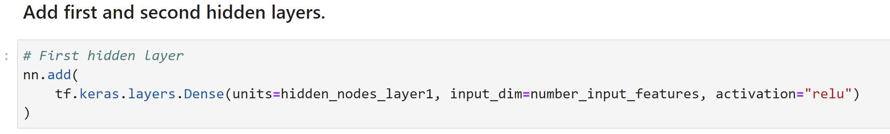
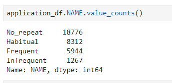

# Neural_Network_Charity_Analysis
## Purpose
 Create a binary classifier that is capable of predicting whether applicants will be successful if funded by Alphabet Soup.
 
## Deliverables:
* Deliverable 1: Preprocessing Data for a Neural Network Model
* Deliverable 2: Compile, Train, and Evaluate the Model
* Deliverable 3: Optimize the Model
* Deliverable 4: A Written Report on the Neural Network Model (README.md)

 ## Data
Customer provided a CSV file of past funding efforts(charity_data.csv)

* EIN and NAME—Identification columns
* APPLICATION_TYPE—Alphabet Soup application type
* AFFILIATION—Affiliated sector of industry
* CLASSIFICATION—Government organization classification
* USE_CASE—Use case for funding
* ORGANIZATION—Organization type
* STATUS—Active status
* INCOME_AMT—Income classification
* SPECIAL_CONSIDERATIONS—Special consideration for application
* ASK_AMT—Funding amount requested
* IS_SUCCESSFUL—Was the money used effectively

 ### Deliverable 1: Preprocessing Data for a Neural Network Model
1. Read in the charity_data.csv to a Pandas DataFrame, and be sure to identify the following in your dataset:
    * What variable(s) are considered the target(s) for your model?
        - APPLICATION_TYPE        34299 non-null  object
        - AFFILIATION             34299 non-null  object
        - CLASSIFICATION          34299 non-null  object
        - USE_CASE                34299 non-null  object
        - ORGANIZATION            34299 non-null  object
        - STATUS                  34299 non-null  int64 
        - INCOME_AMT              34299 non-null  object
        - SPECIAL_CONSIDERATIONS  34299 non-null  object
        - ASK_AMT                 34299 non-null  int64 

    * What variable(s) are considered the feature(s) for your model?
        - IS_SUCCESSFUL—Was the money used effectively
2. Drop the EIN and NAME columns.

3. Determine the number of unique values for each column.

4. For those columns that have more than 10 unique values, determine the number of data points for each unique value.

5. Create a density plot to determine the distribution of the column values.

6. Use the density plot to create a cutoff point to bin "rare" categorical variables together in a new column, Other, and then check if the binning was successful.

7. Generate a list of categorical variables.

8. Encode categorical variables using one-hot encoding, and place the variables in a new DataFrame.

9. Merge the one-hot encoding DataFrame with the original DataFrame, and drop the originals.

10. Split the preprocessed data into features and target arrays.

11. Split the preprocessed data into training and testing datasets.

12. Standardize numerical variables using Scikit-Learn’s StandardScaler class, then scale the data.

Findings: The model did not achieve 75% accuracy, and therefore is not useable.

### Deliverable 2: Compile, Train, and Evaluate the Model
1. Continue using the AlphabetSoupCharity.ipynb file where you’ve already performed the preprocessing steps from Deliverable 1.
2. Create a neural network model by assigning the number of input features and nodes for each layer using Tensorflow Keras.

3. Create the first hidden layer and choose an appropriate activation function.

If necessary, add a second hidden layer with an appropriate activation function.

4. Create an output layer with an appropriate activation function.

5. Check the structure of the model.

6. Compile and train the model.

7. Create a callback that saves the model's weights every 5 epochs.

8. Evaluate the model using the test data to determine the loss and accuracy.

In this section I will do the following:
1. Feature Selection & Model Refinement

2. Drop columns “EIN, NAME”

3. Drop “low information” columns “STATUS”, “SPECIAL_CONSIDERATIONS”

4. Bin low value counts “APPLICATION_TYPE”, occurrence“CLASSIFICATION”
[pic](./Images/app_type_bin.png)

5. Added a hidden layer

6. Dropped the epochs down to 50

Steps:
1. Create a new Jupyter Notebook file and name it AlphabetSoupCharity_Optimzation.ipynb.

2. Import your dependencies, and read in the charity_data.csv to a Pandas DataFrame.

3. Preprocess the dataset like you did in Deliverable 1, taking into account any modifications to optimize the model.

4. Design a neural network model, taking into account any modifications that will optimize the model to achieve higher than 75% accuracy.

5. Create a callback that saves the model's weights every 5 epochs.

6. Save and export your results to an HDF5 file, and name it AlphabetSoupCharity_Optimization.h5.

7. Save your AlphabetSoupCharity_Optimzation.ipynb file and AlphabetSoupCharity_Optimization.h5 file to your Neural_Network_Charity_Analysis folder.

Findings: The model did not achieve 75% accuracy, and therefore is not useable.
## Deliverable 3-2: Optimize the Model (Feature Selection, add hidden layer, and Activation)

In the section I will do everything from D31 and the following:

1. Bucketed “NAME” into four categories

2. Added a hidden layer and changed activation functions to sigmoid

Steps:
1. Create a new Jupyter Notebook file and name it AlphabetSoupCharity_Optimzation.ipynb.
2. Import your dependencies, and read in the charity_data.csv to a Pandas DataFrame.
3. Preprocess the dataset like you did in Deliverable 1, taking into account any modifications to optimize the model.

4. Design a neural network model, taking into account any modifications that will optimize the model to achieve higher than 75% accuracy.

5. Create a callback that saves the model's weights every 5 epochs.

6. Save and export your results to an HDF5 file, and name it AlphabetSoupCharity_Optimization.h5.

7. Save your AlphabetSoupCharity_Optimzation.ipynb file and AlphabetSoupCharity_Optimization.h5 file to your Neural_Network_Charity_Analysis folder.

Findings: The model did not achieve 75% accuracy, and therefore is not useable.
## Deliverable 3-3: Optimize the Model (New Feature Selection)

In the section I will do everything from D31 and D32 and the following:
1. Binned “NAME” into an other category for all values less than or equal to five

1. Create a new Jupyter Notebook file and name it AlphabetSoupCharity_Optimzation.ipynb.

2. Import your dependencies, and read in the charity_data.csv to a Pandas DataFrame.

3. Preprocess the dataset like you did in Deliverable 1, taking into account any modifications to optimize the model.

4. Design a neural network model, taking into account any modifications that will optimize the model to achieve higher than 75% accuracy.

5. Create a callback that saves the model's weights every 5 epochs.

6. Save and export your results to an HDF5 file, and name it AlphabetSoupCharity_Optimization.h5.

7. Save your AlphabetSoupCharity_Optimzation.ipynb file and AlphabetSoupCharity_Optimization.h5 file to your Neural_Network_Charity_Analysis folder.

Findings: The model achieved over 75% accuracy, and therefore is useable but random forest classifier did almost as well and required less work. I think either model would be fine.
## Deliverable 3-4: Optimize the Model (add Random Forest Claasifier)

In the section I will do everything from D31 and D32 and the following:
1. Created a RandomForestClassifier for comparison.

Steps:
1. Create a new Jupyter Notebook file and name it AlphabetSoupCharity_Optimzation.ipynb.

2. Import your dependencies, and read in the charity_data.csv to a Pandas DataFrame.

3. Preprocess the dataset like you did in Deliverable 1, taking into account any modifications to optimize the model.

4. Design a neural network model, taking into account any modifications that will optimize the model to achieve higher than 75% accuracy.

5. Create a callback that saves the model's weights every 5 epochs.

6. Save and export your results to an HDF5 file, and name it AlphabetSoupCharity_Optimization.h5.

7. Save your AlphabetSoupCharity_Optimzation.ipynb file and AlphabetSoupCharity_Optimization.h5 file to your Neural_Network_Charity_Analysis folder.

Findings: The model achieved over 75% accuracy, and therefore is useable but D33 did better but with more work. I think either model would be fine.